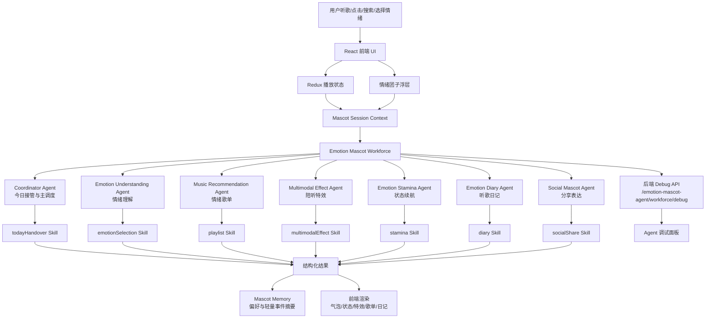

# Lyriks 情绪团子产品文档

Lyriks 是一个以音乐播放为基础、以「情绪团子」为核心陪伴入口的音乐体验产品。它不是单纯的播放器，也不是重度养成游戏，而是在用户听歌、选歌、搜索、分享和停留的过程中，让一个轻量的情绪陪伴 Agent 参与进来，把「我现在想怎么听歌」变成可选择、可反馈、可积累的体验。

当前项目基于 React/Vite 构建，保留发现页、排行榜、歌手页、搜索、歌曲详情、播放器等音乐应用能力，并新增情绪团子浮层、播放空间、雨夜补给站小游戏、多 Agent 调试面板和情绪状态工作流。

## 一、产品简介

### 1. 要解决的问题

传统音乐 App 更多围绕歌曲、榜单、歌手和推荐流组织体验，用户可以快速找到内容，但「为什么此刻想听这首歌」「希望音乐怎么陪自己」通常没有被产品显性承接。

用户在真实听歌场景中常见的问题包括：

1. 情绪入口弱：用户打开 App 时，经常不是为了某首确定的歌，而是想找一种状态，例如放松、EMO、专注、通勤提神或睡前安静。
2. 推荐解释弱：推荐结果往往只告诉用户「听什么」，很少表达「为什么适合现在」以及「接下来可以怎么听」。
3. 播放过程陪伴弱：音乐播放页通常是封面、歌词和控制器，用户听歌时的情绪反馈、轻互动和状态变化不足。
4. 长期记忆弱：用户每次听歌产生的情绪选择、歌单偏好和状态变化，很少沉淀成一个「越来越懂我」的陪伴关系。
5. 社交表达生硬：分享歌曲常常只是链接转发，缺少更轻、更有情绪温度的表达方式。

### 2. 要解决的方案

Lyriks 的方案是把「情绪团子」设计成音乐 App 内的情绪陪伴型 Agent，用一个可视化小宠物承接用户的听歌状态，并通过多 Agent 工作流把情绪理解、音乐推荐、播放陪伴、状态续航、日记总结和社交分享拆成可控能力。

核心思路：

1. 用情绪团子作为全局入口：团子悬浮在音乐 App 中，随播放状态、节奏和用户选择产生动作反馈。
2. 用一级情绪和二级动作状态组织听歌：例如 EMO、放松、专注、元气等情绪，可以进一步映射为雨夜补给、海边放松、书桌专注等具体场景。
3. 用播放空间增强陪听：在 `/play` 页面展示当前歌曲、歌词信息、歌曲元数据和情绪小游戏，让听歌过程可互动。
4. 用轻游戏机制沉淀陪伴感：以「雨夜补给站」为代表，用户播放歌曲或点击掉落物即可积累共鸣能量，不设失败、不惩罚、不打断音乐。
5. 用 Agent 工作流提供智能决策：不同场景由不同子 Agent 处理，输出结构化结果，再由前端组件展示。
6. 用长期记忆形成个性化：记录用户常选情绪、常听风格、偏好时段和打扰偏好，但不做心理诊断。

## 二、产品功能介绍

### 1. 音乐发现与播放

当前应用保留完整音乐产品基础能力：

- 发现页：浏览推荐歌曲和内容流。
- 榜单页：查看热门歌曲和热门歌手。
- 附近音乐：基于位置或区域语境探索音乐。
- 搜索：按关键词检索歌曲、歌手或相关内容。
- 歌曲详情：查看歌曲信息、关联歌曲和歌手信息。
- 底部播放器：支持播放、暂停、进度、音量和当前歌曲展示。

### 2. 情绪团子浮层

情绪团子是全局可见的陪伴入口，主要承担三类功能：

- 状态展示：根据当前情绪、播放状态和互动模式展示不同表情、动作、皮肤和特效。
- 快捷交互：用户可以通过团子打开状态设置、查看 Agent 接管提示或进入播放空间。
- 节奏响应：团子可以基于音频节奏和播放状态产生轻微动效，让播放过程更有生命感。

### 3. 情绪状态与设置

团子支持情绪和动作状态配置，用户可以主动选择自己当前想要的听歌状态。系统也可以基于时间段、最近听歌行为和偏好生成推荐状态，但任何状态切换都需要用户确认。

首版状态设计强调克制表达：

- 不诊断用户心理状态。
- 不用强判断语气定义用户情绪。
- 不强行让用户从低落变开心。
- 在低落、EMO、孤独等状态下优先陪伴、承认和轻量引导。

### 4. 播放空间

`/play` 页面是 Lyriks 的沉浸式听歌空间。用户播放歌曲后，可以从旋转封面进入该页面，看到：

- 当前歌曲封面、歌名和歌手。
- 歌词陪伴文案。
- 歌曲元信息，例如专辑、曲风、发行日期和歌词状态。
- 情绪小游戏「雨夜补给站」。

### 5. 雨夜补给站小游戏

雨夜补给站是 EMO 状态下的轻量陪伴玩法。它的目标不是让用户立刻开心，而是让用户在听完一首歌的过程中感到「情绪被听见」。

玩法规则：

- 播放歌曲后自动积累共鸣能量。
- 页面中掉落雨滴音符、歌词碎片和共鸣光点。
- 用户点击掉落物即可增加能量。
- 能量满后触发团子状态变化和陪伴文案。
- 不设置失败、扣分或 Game Over。

### 6. Agent 调试与可视化

项目提供多 Agent workforce 调试能力，前端可以把当前事件、播放状态、团子状态和 workforce 描述发送到后端调试接口：

`POST /emotion-mascot-agent/workforce/debug`

后端返回 trace id、节点列表、分派步骤和调试信息，用于在产品 UI 中展示一次 Agent 调用如何从前端事件进入上下文构建、主调度、子 Agent 分派、Skill 执行和 UI 渲染。

## 三、技术方案

### 1. Agent 方案

Lyriks 的 Agent 设计采用「主调度 Agent + 专职子 Agent + Skill + Workflow」结构。前端当前实现了一个轻量 `emotionMascotWorkforce`，用于在浏览器侧完成可控、可调试的 Agent 流程；后端提供调试接口，承接类 `/chat` 调用链路和日志记录。

#### a. 多 Agent 架构图



#### b. 什么场景使用什么 Agent

| 场景 | 使用 Agent | 对应 Workflow | 核心 Skill | 输出 |
| --- | --- | --- | --- | --- |
| 用户打开首页，需要今日状态建议 | `emotion_mascot_coordinator` | `moodHandover` | `todayHandover` | 是否提示、推荐情绪、推荐动作、一句接管文案 |
| 用户说「今晚想安静点」或点击情绪设置 | `emotion_understanding_agent` | `emotionSelection` | `emotionSelection` | 一级情绪、二级动作状态、置信度 |
| 用户希望按当前情绪听一组歌 | `music_recommendation_agent` | `playlist` | `playlist` | 情绪歌单旅程、阶段说明、推荐理由 |
| 当前歌曲播放到高潮、歌词段落或节奏变化 | `multimodal_listening_effect_agent` | `multimodalEffect` | `multimodalEffect` | 团子动作、粒子、光效、持续时间 |
| 用户在 EMO/低落/孤独状态停留较久 | `emotion_stamina_agent` | `stamina` | `stamina` | 继续陪伴、温和转场或结束提示 |
| 一段听歌会话结束，需要生成总结 | `emotion_diary_agent` | `diary` | `diary` | 今日听歌日记、状态摘要、非诊断式记录 |
| 用户想分享歌曲或团子状态 | `social_mascot_agent` | `socialShare` | `socialShare` | 分享文案、团子式表达、确认动作 |

Agent 边界：

- 所有重要动作都需要用户确认，尤其是切换状态、改变播放队列和发起分享。
- 低落、EMO、孤独相关场景不做心理诊断，不输出医学化判断。
- Agent 输出优先结构化，由前端决定最终 UI 表现。
- 长期记忆保存偏好摘要，不保存过度敏感或武断的心理结论。

### 2. 前后端简略

#### 前端

前端位于 `lyriks/src`，核心技术栈：

- React 18：构建页面和组件。
- Vite：本地开发和构建。
- Redux Toolkit：管理播放状态，包括当前歌曲、播放/暂停、播放列表等。
- React Router：管理发现页、排行榜、歌曲详情、歌手详情、搜索页和播放空间路由。
- Tailwind CSS + 自定义 CSS：实现音乐应用主视觉、播放器、团子浮层和小游戏样式。

关键目录：

- `src/App.jsx`：应用路由、全局布局、播放器和情绪团子挂载。
- `src/pages/`：发现、榜单、搜索、歌曲详情、歌手详情、播放空间等页面。
- `src/components/MusicPlayer/`：播放器组件。
- `src/features/emotionMascot/`：情绪团子功能，包括状态配置、组件、上下文、Agent、Skill、Workflow 和记忆。
- `src/redux/`：播放状态和音乐数据服务。

#### 后端

后端位于项目根目录 `app`，核心技术栈和职责：

- FastAPI 风格路由：承接前端请求。
- Pydantic：定义请求和响应模型。
- Controller 层：提供聊天、任务、模型、工具和情绪团子 Agent 调试接口。
- Agent 层：包含通用 Agent 工厂、工具包、远程子 Agent、浏览器、文档、多模态、搜索等能力。
- Telemetry/Workforce：记录和观察 Agent 调用链路。

当前与 Lyriks 情绪团子直接相关的接口是：

- `POST /emotion-mascot-agent/workforce/debug`：接收前端 workforce 调试负载，返回可视化节点、分派步骤和 trace id。

#### 前后端交互链路

1. 用户在前端触发播放、点击团子、选择情绪或进入播放空间。
2. 前端读取 Redux 播放状态、团子状态、页面状态和本地记忆。
3. `buildMascotSessionContext` 生成本次 Agent 上下文。
4. `emotionMascotWorkforce.runWorkflow` 根据 workflow 名称分派到对应子 Agent。
5. 子 Agent 调用注册 Skill，生成结构化结果。
6. 前端根据结果更新气泡、状态、特效、歌单、日记或小游戏反馈。
7. 调试模式下，前端把 workforce 描述和上下文发送给后端 debug 接口。
8. 后端返回 trace 节点，前端调试面板展示调用链路。

## 本地运行

```shell
cd lyriks
npm install
npm run dev
```

默认启动后，在浏览器打开 Vite 输出的本地地址即可访问应用。

