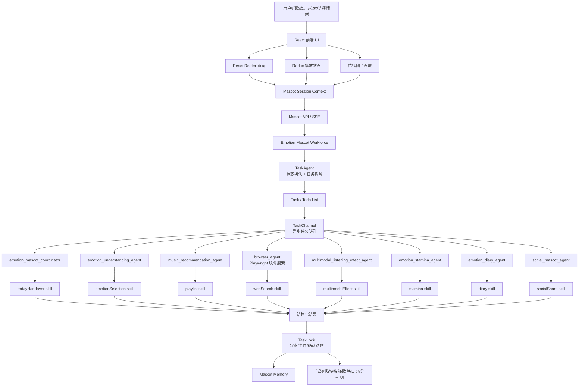
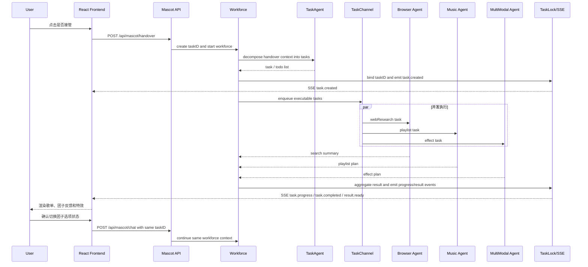
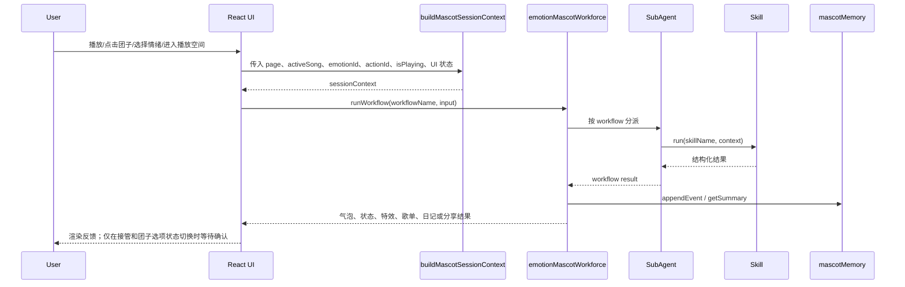

# 情绪团子完整技术方案

> 来源：`README.md`、`public/project-docs/情绪团子方案.html`、当前 `src/features/emotionMascot` 实现。  
> 更新日期：2026-06-17

## 1. 项目定位

Lyriks 是一个以音乐播放为基础、以「情绪团子」为核心陪伴入口的音乐体验产品。它不是单纯播放器，也不是重度养成游戏，而是在用户听歌、选歌、搜索、分享和停留的过程中，让一个轻量可互动的情绪陪伴 Agent 参与进来，把「我现在想怎么听歌」变成可选择、可反馈、可积累的体验。

情绪团子的核心价值是把传统音乐 App 中隐性的听歌动机显性化：用户打开 App 时，常常不是为了某一首确定的歌，而是想找一种状态，例如放松、EMO、专注、通勤提神或睡前安静。产品通过团子浮层、情绪状态、播放空间、轻游戏和多 Agent 工作流，把状态选择、推荐解释、播放陪伴、长期记忆和社交表达串成连续体验。

## 2. 目标与边界

### 2.1 要解决的问题

1. 情绪入口弱：传统音乐产品更擅长组织歌曲、榜单、歌手和推荐流，但没有稳定承接「我现在想要一种状态」。
2. 推荐解释弱：推荐结果往往只告诉用户「听什么」，很少解释「为什么适合现在」以及「接下来可以怎么听」。
3. 播放陪伴弱：播放页通常是封面、歌词和控制器，缺少轻互动、情绪反馈和状态变化。
4. 长期记忆弱：用户的情绪选择、歌单偏好和听歌时段很少沉淀成「越来越懂我」的陪伴关系。
5. 社交表达生硬：分享歌曲常常只是链接转发，缺少更轻、更有情绪温度的表达。

### 2.2 产品边界

1. 不做心理诊断，不输出医学化、武断化结论。
2. 不强行把低落、EMO、孤独等状态扭转成开心。
3. 前端只保留两个用户确认入口：是否接管，以及是否切换团子的相关选项状态。
4. 轻互动服务于听歌主线，不设置失败、不扣分、不 Game Over，不把产品重心变成重度游戏。
5. 长期记忆只保存偏好摘要和轻量事件，不保存过度敏感或无法解释的心理标签。

## 3. 整体方案

情绪团子采用「前端音乐应用 + 情绪团子浮层 + 播放空间 + 后端 Agent workforce + TaskAgent + toolkit + 轻量记忆」的架构。

当前仓库已经落地的是前端轻量 Agent workforce：在浏览器内用确定性 skill、subAgent、workflow 和 localStorage memory 模拟多 Agent 调度。完整技术方案在此基础上强化为后端多 Agent 协作系统：前端只负责两类人机确认，第一次「是否接管」会启动 Agent 并生成 `taskID`，后续「切换团子的相关选项状态」会带着同一个 `taskID` 继续 `/chat`；Workforce 在后端统一接收上下文、调度 TaskAgent 拆解任务、通过 TaskChannel 分发给专职 Agent 并发执行，最终由 TaskLock/任务状态管理器把执行进度和结果通过接口或 SSE 同步给前端。



## 4. 前端技术方案

### 4.1 技术栈

| 模块 | 技术 | 职责 |
| --- | --- | --- |
| 应用框架 | React 18 | 页面、组件和交互状态 |
| 构建工具 | Vite | 本地开发、打包构建 |
| 路由 | React Router | 发现页、榜单、搜索、详情、播放空间 |
| 状态管理 | Redux Toolkit | 当前歌曲、播放列表、播放/暂停等播放状态 |
| 样式 | Tailwind CSS + 自定义 CSS | 音乐应用主视觉、播放器、团子浮层、小游戏 |
| Agent 前端实现 | JS workflow + skill registry | 情绪团子本地调度、结构化结果生成 |
| Agent 后端方案 | Workforce + TaskAgent + TaskChannel + TaskLock | 任务拆解、并发执行、状态同步、`taskID` 生命周期 |
| 联网搜索 | Browser Agent + Playwright | 搜索音乐趋势、歌单线索和外部资料 |
| 轻量记忆 | localStorage | 最近事件、接管偏好、状态摘要 |

### 4.2 页面与组件结构

| 路径 | 职责 |
| --- | --- |
| `src/App.jsx` | 应用路由、全局布局、底部播放器、情绪团子挂载 |
| `src/pages/Discover.jsx` | 音乐发现页，承接今日接管建议 |
| `src/pages/TopCharts.jsx` / `TopArtists.jsx` | 榜单与热门歌手 |
| `src/pages/Search.jsx` | 搜索歌曲和歌手 |
| `src/pages/SongDetails.jsx` / `ArtistDetails.jsx` | 歌曲与歌手详情 |
| `src/pages/AroundYou.jsx` | 附近音乐或区域语境探索 |
| `src/pages/PlaySpace.jsx` | 沉浸式播放空间和雨夜补给站小游戏 |
| `src/components/MusicPlayer/` | 底部播放器、控制器、进度条、音量、曲目信息 |
| `src/features/emotionMascot/` | 情绪团子主功能，包括上下文、组件、配置、Agent、workflow 和记忆 |

### 4.3 情绪团子 UI 模块

| 模块 | 文件 | 职责 |
| --- | --- | --- |
| 全局团子入口 | `FloatingBeatMascot.jsx` | 悬浮展示、拖拽、节奏动效、打开设置/进入播放空间 |
| 状态上下文 | `context/EmotionMascotContext.jsx` | 管理情绪、动作、皮肤、特效开关、接管提示等状态 |
| 团子主体 | `components/MascotFigure.jsx` | 根据情绪、动作、皮肤和播放状态渲染团子形象 |
| 设置弹窗 | `components/MascotSettingsModal.jsx` | 情绪、动作、皮肤、偏好等配置入口 |
| 状态面板 | `components/MascotStatusPanel.jsx` | 展示当前情绪、动作状态和说明 |
| 接管气泡 | `components/AgentHandoverBubble.jsx` | 今日接管建议；用户确认接管后启动 Agent 并生成 `taskID` |
| 多模态效果层 | `components/MultimodalEffectLayer.jsx` | 粒子、光效、气泡、节奏反馈 |
| 配置文件 | `config/*.js(x)` | 情绪、动作、皮肤套装、布局、设置 Tab |

### 4.4 播放空间与轻游戏

`/play` 页面是沉浸式听歌空间。用户播放歌曲后，可以从旋转封面进入页面，看到当前歌曲封面、歌名、歌手、歌词陪伴文案、专辑/曲风/发行日期等歌曲元信息，以及情绪小游戏「雨夜补给站」。

首个小游戏采用「轻放置 + 微节奏收集 + 情绪陪伴」机制：

1. 用户选择 EMO 或深夜 EMO 后，播放歌曲时进入雨夜场景。
2. 歌曲播放会自动积累共鸣能量。
3. 场景中掉落雨滴音符、歌词碎片、共鸣光点。
4. 用户点击或接住掉落物后增加能量。
5. 能量满后，团子从「低电量 EMO」变成「被陪伴的 EMO」，雨变小，小夜灯亮起。
6. 不设置失败、不扣分、不 Game Over。

后续情绪玩法可以复用同一套底层机制：播放触发、掉落物、能量条和团子反馈，差异主要体现在场景主题、掉落物和奖励表达。

| 情绪 | 小游戏主题 | 场景关键词 | 掉落物 |
| --- | --- | --- | --- |
| EMO | 雨夜补给站 | 雨夜、月亮、小夜灯、慢速呼吸 | 雨滴音符、歌词碎片、共鸣光点 |
| 放松 | 海边漂流 | 海浪、泡泡、躺平漂流 | 泡泡、贝壳、月光 |
| 元气 | 节拍充电站 | 充电台、星星、跳跃节拍 | 星星、能量球、火花 |
| 专注 | 书桌整理 | 书桌、时钟、灵感点 | 书页、时钟碎片、灵感点 |

## 5. Agent 调度技术方案

### 5.1 方案抽象

产品方案中，情绪团子采用「Workforce + TaskAgent + TaskChannel + Agent Workers + TaskLock」的多 Agent 协作架构。它的重点不是让每个 Agent 独立响应前端，而是由 Workforce 统一管理任务拆解、任务分发、并发执行、状态同步和 `taskID` 生命周期。前端只需要处理两个用户确认入口：是否接管，以及是否切换团子的相关选项状态。

| 组件 | 职责 |
| --- | --- |
| `EmotionMascotWorkforce` | 主编排器，接收用户请求和上下文，管理任务生命周期、任务分配、结果聚合和错误恢复 |
| `TaskAgent` | 在用户确认「是否接管」后，基于生成的 `taskID` 把复杂请求拆解为可执行 task / todo list，并标记依赖关系、优先级和负责 Agent 类型 |
| `TaskChannel` | 异步队列式通信层，负责 Workforce 与 Agent Workers 之间的任务投递、状态回传和并发调度 |
| `TaskLock` | 项目级状态管理器，维护 `taskID`、任务状态、SSE 事件队列和幂等锁，避免重复启动或重复续写同一任务 |
| `Agent Workers` | 专职执行者，每个 Agent 只处理自己领域内的子任务，并通过 toolkit 调用能力 |
| `Toolkit / Skill` | 可复用能力集合，例如情绪识别、歌单生成、联网搜索、特效规划、日记、分享 |

完整方案中的 Agent 分工如下：

| Agent | 职责 | 典型 Toolkit |
| --- | --- | --- |
| `task_agent` / `TaskAgent` | 用户确认接管后组织任务拆解，生成 task / todo list | Task planning、dependency analysis |
| `emotion_mascot_coordinator` | 前台场景总协调，处理今日接管、`taskID` 创建、任务聚合 | `todayHandover` |
| `emotion_understanding_agent` | 理解用户自然语言或点击选择，映射一级情绪与二级动作状态 | `emotionSelection` |
| `music_recommendation_agent` | 生成情绪歌单旅程、推荐理由、播放队列建议 | `playlist` |
| `browser_agent` | 只负责联网搜索和网页信息采集，可用 Playwright / SearchToolkit，不负责前台状态编排 | `webSearch`、`playwrightSearch` |
| `multimodal_listening_effect_agent` | 生成歌曲高潮、歌词段落、节奏变化对应的团子动作、粒子和光效 | `multimodalEffect` |
| `emotion_stamina_agent` | 判断是否继续陪伴、温和转场或结束当前状态 | `stamina` |
| `emotion_diary_agent` | 生成听歌日记、状态摘要和私人记录 | `diary` |
| `social_mascot_agent` | 生成分享文案和分享卡内容，结果归入同一 `taskID` 上下文 | `socialShare` |

不同业务能力不直接写死在 Agent 内，而是沉淀为 toolkit / skill。Workflow 负责定义业务流程，TaskAgent 负责把一次用户意图拆成可执行任务，Workforce 负责调度任务执行和结果合并。

### 5.2 前端人机确认入口

前端只保留两个需要用户确认的人机交互入口，其余任务确认、任务依赖、Agent 分派和中间结果都由后端 Workforce 管理。

| 确认入口 | 前端行为 | 后端行为 | 返回 |
| --- | --- | --- | --- |
| 是否接管 | 用户在接管气泡点击接受/忽略；接受时调用启动接口 | 创建 `taskID`，启动 Workforce，调用 TaskAgent 生成 task / todo list | `taskID`、初始状态、SSE 订阅地址 |
| 切换团子的相关选项状态 | 用户在设置弹窗确认情绪、动作、皮肤、模式等状态切换 | 带同一个 `taskID` 调用 `/chat`，Workforce 在同一任务上下文里继续调度 | 更新后的状态建议、任务进度、前端渲染 payload |

这意味着前端不再弹出「确认任务计划」「确认播放队列」「确认分享发布」等额外确认层。相关动作如果需要谨慎处理，应由 Agent 输出建议和解释，由现有两个入口承接：接管前不启动任务，接管后所有团子状态类变更都沿用同一个 `taskID` 继续会话。

### 5.3 TaskAgent 任务拆解

`TaskAgent` 的新增职责是在用户确认「是否接管」并生成 `taskID` 之后，把「我现在想怎么听歌」转成明确的 task / todo list。它不直接执行任务，而是输出结构化计划。

输入包括：

1. `sessionContext`：页面、播放、情绪、动作、时间段、UI 状态。
2. `userIntent`：用户自然语言、点击行为或确认动作。
3. `taskID`：是否接管后创建的任务标识，后续状态切换和 `/chat` 都复用它。
4. `confirmedState`：用户已经确认或正在切换的一级情绪、二级动作、皮肤、交互模式等团子选项状态。
5. `memorySummary`：最近偏好、最近接受的接管状态、近期互动事件。
6. `availableAgents`：当前可调度的 Agent Workers 与 toolkit。

输出结构示例：

```json
{
  "planId": "plan_20260617_001",
  "taskID": "task_20260617_001",
  "confirmedState": {
    "emotionId": "emo",
    "actionId": "rainyNight"
  },
  "tasks": [
    {
      "subTaskId": "subtask_001",
      "title": "搜索适合深夜 EMO 的歌曲线索",
      "agent": "browser_agent",
      "toolkit": "webSearch",
      "dependsOn": [],
      "priority": 1
    },
    {
      "subTaskId": "subtask_002",
      "title": "生成三阶段情绪歌单旅程",
      "agent": "music_recommendation_agent",
      "toolkit": "playlist",
      "dependsOn": ["subtask_001"],
      "priority": 2
    },
    {
      "subTaskId": "subtask_003",
      "title": "生成雨夜补给站陪听特效",
      "agent": "multimodal_listening_effect_agent",
      "toolkit": "multimodalEffect",
      "dependsOn": [],
      "priority": 2
    }
  ],
  "humanInteraction": "handover_accepted"
}
```

拆解规则：

1. 先确认是否接管并生成 `taskID`，再生成任务列表。
2. 每个任务只交给一个主责 Agent。
3. 没有依赖关系的任务可以并发执行。
4. 切换团子的相关选项状态时，不创建新任务，必须带同一个 `taskID` 继续 `/chat`。
5. 前端不展示额外任务计划确认；任务计划只作为后端调度和调试信息。
6. `browser_agent` 只用于搜索和网页信息采集，不承接情绪判断和 UI 决策。

### 5.4 当前实现结构

当前代码位于 `src/features/emotionMascot/agent`，采用前端可执行的轻量 workforce。

| 目录/文件 | 职责 |
| --- | --- |
| `constants.js` | Agent 角色、workflow 名称、交互枚举 |
| `context/buildMascotContext.js` | 将页面、播放、情绪、动作、UI 状态整理成 session context |
| `memory/mascotMemory.js` | 本地 Agent 记忆摘要，保留轻量事件，不做心理诊断 |
| `toolkit/skillRegistry.js` | skill 注册、查询和执行入口 |
| `skills/` | 确定性能力模块，包括今日接管、情绪选择、歌单、续航、日记、社交、多模态特效 |
| `subAgents/` | 专职子 Agent，限制每个 Agent 可调用的 skill |
| `workflows/` | 把用户事件、上下文、子 Agent 和结果串成可执行流程 |
| `workforce/createEmotionMascotWorkforce.js` | 主调度器，统一暴露 `describe()` 和 `runWorkflow()` |
| `index.js` | 对外导出 `emotionMascotWorkforce`、`runMascotWorkflow()` 等入口 |

当前实现可以视作完整后端调度方案的前端预演版本。后续落地后端时，可以保留 `runMascotWorkflow()` 作为前端调用入口，把内部执行从本地 skill registry 替换为 HTTP/SSE 调用。

### 5.5 子 Agent 与 Skill

| 子 Agent | Skill | 说明 |
| --- | --- | --- |
| `task_agent` | `taskPlanning` | 接管后基于 `taskID` 生成 task / todo list |
| `emotion_mascot_coordinator` | `todayHandover` | 今日情绪接管与主调度 |
| `emotion_understanding_agent` | `emotionSelection` | 自然语言或点击选择到一级情绪、二级动作状态 |
| `music_recommendation_agent` | `playlist` | 构建有起承转合的情绪歌单旅程 |
| `browser_agent` | `webSearch` / `playwrightSearch` | 只负责联网搜索、页面抓取和信息整理 |
| `multimodal_listening_effect_agent` | `multimodalEffect` | 生成短时团子动作、粒子、光效计划 |
| `emotion_stamina_agent` | `stamina` | 判断继续陪伴、温和转场或结束提示 |
| `emotion_diary_agent` | `diary` | 生成听歌状态总结，不做心理诊断 |
| `social_mascot_agent` | `socialShare` | 生成团子式音乐分享表达，交由同一 `taskID` 的会话上下文承接 |

### 5.6 Workflow 场景矩阵

| 场景 | Workflow | Agent / Toolkit | 核心输出 |
| --- | --- | --- | --- |
| 用户确认是否接管 | `handoverStart` | `emotion_mascot_coordinator` + `TaskAgent` | `taskID`、task / todo list、SSE 订阅地址 |
| 用户切换团子的相关选项状态 | `chat` | 同一 `taskID` 的 Workforce / `/chat` | 状态更新建议、继续调度结果、前端渲染 payload |
| 首页需要今日歌单推荐建议 | `moodHandover` | `emotion_mascot_coordinator` / `todayHandover` | 根据情绪/状态生成今日接管建议和推荐方向 |
| 需要联网获取音乐趋势、歌单线索或资料 | `webResearch` | `browser_agent` / `webSearch`、`playwrightSearch` | 搜索结果、来源摘要、可引用线索 |
| 用户表达「今晚想安静点」或点击情绪设置 | `emotionSelection` | `chat-agent` / `emotionSelection` | 一级情绪、二级动作状态和置信度 |
| 用户希望按当前情绪听一组歌 | `playlist` | `chat-agent` / `playlist` | 情绪歌单旅程、阶段说明和推荐理由 |
| 歌曲播放到高潮、歌词段落或节奏变化 | `multimodalEffect` | `multiModal-agent` / `multimodalEffect` | 团子动作、粒子、光效和持续时间 |
| 用户在 EMO、低落或孤独状态停留较久 | `stamina` | `chat-agent` / `stamina` | 继续陪伴、温和转场或结束提示 |
| 一段听歌会话结束，需要总结或分享 | `diary` / `socialShare` | `chat-agent` / `diary`、`socialShare` | 听歌日记、状态摘要、分享文案 |

### 5.7 End-to-End Workforce Orchestration



### 5.8 并发执行与依赖管理

Workforce 按任务依赖图调度执行：

1. `dependsOn` 为空的任务进入同一批次并发执行。
2. 依赖搜索结果的任务等待 `browser_agent` 返回后再执行。
3. 多模态特效、团子文案、状态续航通常可以与歌单生成并发。
4. 所有 Agent Worker 只返回结构化结果，不直接改前端状态。
5. Workforce 聚合结果后生成统一响应，并通过 TaskLock 记录执行状态。
6. 失败任务可以局部重试，不影响已经完成的无依赖任务。

示例：用户点击「接管」后，后端创建 `taskID=task_20260617_001`，`TaskAgent` 可以拆出三类并发任务：`browser_agent` 搜索当下适合的歌曲线索，`multimodal_listening_effect_agent` 生成雨夜特效，`emotion_stamina_agent` 生成低打扰陪伴策略；待搜索完成后，`music_recommendation_agent` 再生成最终歌单旅程。用户之后切换「平静 / 通勤 / 低动效」等团子选项时，前端继续带 `task_20260617_001` 调用 `/chat`。

### 5.9 当前前端轻量调用链路



### 5.10 Session Context

`buildMascotSessionContext` 将前端散落状态统一整理为 Agent 可理解的上下文：

| 字段 | 说明 |
| --- | --- |
| `date` | 今日日期 key |
| `timeBand` | 当前时段，用于早晨/白天/夜晚等语境 |
| `page` | 当前页面，例如 `discover`、`play` |
| `taskID` | 接管后生成的任务标识；后续 `/chat` 与状态切换复用 |
| `emotion` | 当前一级情绪配置 |
| `action` | 当前二级动作状态配置 |
| `playback.isPlaying` | 当前是否播放 |
| `playback.song` | 歌名、歌手、曲风等歌曲摘要 |
| `interactionMode` | `normal`、`active`、`quiet` |
| `effectsEnabled` | 多模态特效是否开启 |
| `ui` | 是否拖拽、设置弹窗是否打开、视觉状态等 |

### 5.11 结构化输出规范

Agent/Skill 输出必须优先结构化，再由前端决定最终 UI 表现。推荐字段：

| 类型 | 推荐字段 |
| --- | --- |
| 任务计划 | `taskID`、`planId`、`tasks`、`dependsOn`、`agent`、`priority`、`humanInteraction` |
| 今日接管 | `title`、`message`、`emotionId`、`actionId`、`choices`、`handoverStatus` |
| 情绪选择 | `emotionId`、`actionId`、`confidence`、`reason`、`suggestedCopy` |
| 联网搜索 | `query`、`sources`、`summary`、`confidence`、`retrievedAt` |
| 歌单旅程 | `stages`、`songs`、`reasoning`、`nextAction` |
| 多模态特效 | `mascotAction`、`particles`、`lighting`、`durationMs`、`intensity` |
| 情绪续航 | `decision`、`message`、`transitionTarget`、`taskID` |
| 日记总结 | `summary`、`moodTags`、`songHighlights`、`privateNote` |
| 社交分享 | `shareText`、`shareCardData`、`taskID` |

## 6. 数据与状态设计

### 6.1 Redux 播放状态

Redux 负责音乐播放主状态，包括当前歌曲、播放队列、播放/暂停、当前索引等。情绪团子不直接替代播放器状态，而是读取播放上下文并生成陪伴反馈。

### 6.2 情绪团子上下文状态

`EmotionMascotContext` 负责管理团子自己的 UI 与业务状态，包括当前情绪、当前动作、皮肤套装、设置弹窗、接管气泡、多模态特效开关等。

### 6.3 本地记忆

`mascotMemory` 使用 `localStorage` 保存轻量事件：

1. 最近最多保留 40 条事件。
2. `getSummary()` 返回最近 8 条事件、累计事件数、最近接受的情绪和动作。
3. 写入失败时静默降级，核心 UI 不受影响。
4. 记忆只保存行为和偏好摘要，不保存心理诊断结论。

## 7. 后端与大模型接入方案

当前仓库中的情绪团子 Agent 主要是前端轻量实现。完整方案需要补充后端接口层，把前端的两个确认入口、Agent 调度、任务进度和结果渲染连接起来。后端不直接替前端改 UI，而是返回结构化状态和动作建议。

### 7.1 后端职责

| 层级 | 职责 |
| --- | --- |
| API 层 | 提供接管启动、同任务 `/chat`、任务状态查询、记忆读写等接口 |
| Schema 层 | 用 Pydantic 或同类工具约束请求和响应结构 |
| Workforce 层 | 管理任务拆解、任务队列、并发执行、依赖调度、错误恢复 |
| TaskAgent 层 | 在用户状态确认后生成 task / todo list |
| Agent Worker 层 | 承接情绪理解、音乐推荐、联网搜索、多模态特效、日记、分享等真实能力 |
| Toolkit 层 | 封装音乐检索、Playwright 搜索、推荐、歌词摘要、记忆读写、分享卡生成等能力 |
| TaskLock/SSE 层 | 记录 `taskID`、任务状态、幂等锁和前端事件推送 |
| Telemetry 层 | 记录 workflow、任务耗时、错误、接管接受率、状态切换率、推荐点击和转化数据 |

### 7.2 前后端交互

前端仍可以保留 `runMascotWorkflow(workflowName, input)` 作为本地预演入口。接入后端后，前端只需要对接两个写接口：`POST /api/mascot/handover` 和 `POST /api/mascot/chat`。

1. 前端构造 `sessionContext`。
2. 用户确认「是否接管」后，前端调用 `POST /api/mascot/handover`。
3. 后端创建 `taskID`，启动 Workforce，调用 TaskAgent 生成 task / todo list。
4. Workforce 将可执行任务投递到 TaskChannel，并发调度 Agent Workers。
5. 后端通过 SSE 推送 `task.created`、`task.progress`、`task.completed`、`result.ready`、`task.failed` 等事件。
6. 前端按同一套 UI contract 渲染气泡、状态、特效、歌单和日记。
7. 用户确认「切换团子的相关选项状态」后，前端调用 `POST /api/mascot/chat`，并传入同一个 `taskID`。
8. 后端在同一个 Workforce 上下文中继续调度，不创建新的 `taskID`。

### 7.3 REST 接口草案

| 方法 | 路径 | 说明 |
| --- | --- | --- |
| `POST` | `/api/mascot/handover` | 用户确认是否接管；接受时创建 `taskID` 并启动 Workforce |
| `POST` | `/api/mascot/chat` | 同一个 `taskID` 的继续会话；用于切换团子的相关选项状态 |
| `GET` | `/api/mascot/tasks/{taskID}` | 查询任务状态、任务列表、聚合结果 |
| `POST` | `/api/mascot/tasks/{taskID}/cancel` | 取消未完成任务 |
| `POST` | `/api/mascot/subtasks/{subTaskId}/retry` | 重试失败子任务 |
| `GET` | `/api/mascot/events?taskID={taskID}` | SSE 事件流，用于任务进度和结果推送 |
| `GET` | `/api/mascot/memory/summary` | 获取用户授权范围内的轻量记忆摘要 |
| `DELETE` | `/api/mascot/memory` | 清除情绪团子记忆 |
| `POST` | `/api/mascot/search` | 由 `browser_agent` 触发的联网搜索接口，可使用 Playwright |

### 7.4 接管启动接口

```http
POST /api/mascot/handover
Content-Type: application/json

{
  "clientRequestId": "req_20260617_001",
  "handoverAccepted": true,
  "sessionContext": {
    "page": "discover",
    "emotion": { "id": "emo" },
    "action": { "id": "rainy-night" },
    "playback": {
      "isPlaying": true,
      "song": {
        "title": "Song Name",
        "artistName": "Artist",
        "genreNames": ["Pop"]
      }
    },
    "timeBand": "night"
  },
  "input": {
    "trigger": "today_handover",
    "userText": "今晚想安静一点"
  }
}
```

```json
{
  "taskID": "task_20260617_001",
  "status": "running",
  "sseUrl": "/api/mascot/events?taskID=task_20260617_001",
  "plan": {
    "planId": "plan_20260617_001",
    "tasks": [
      {
        "subTaskId": "subtask_001",
        "title": "确认用户想要的安静听歌状态",
        "agent": "emotion_understanding_agent",
        "toolkit": "emotionSelection",
        "dependsOn": [],
        "status": "planned"
      }
    ]
  },
  "initialResult": {
    "emotionId": "calm",
    "actionId": "commute",
    "confidence": 0.82,
    "reason": "用户表达了安静、低刺激的听歌需求。"
  }
}
```

如果用户选择不接管，前端不启动 Agent，也不生成 `taskID`：

```http
POST /api/mascot/handover
Content-Type: application/json

{
  "clientRequestId": "req_20260617_002",
  "handoverAccepted": false
}
```

```json
{
  "taskID": null,
  "status": "dismissed"
}
```

### 7.5 同 Task Chat 接口

切换团子的相关选项状态时，前端调用 `/chat`，必须传同一个 `taskID`。该接口用于继续同一个 Workforce 上下文，而不是创建新任务。

```http
POST /api/mascot/chat
Content-Type: application/json

{
  "taskID": "task_20260617_001",
  "messageType": "mascot_state_change",
  "statePatch": {
    "emotionId": "calm",
    "actionId": "commute",
    "skinSuiteId": "rainy-night",
    "interactionMode": "quiet"
  },
  "sessionContext": {
    "page": "play",
    "playback": {
      "isPlaying": true,
      "song": {
        "title": "Song Name",
        "artistName": "Artist"
      }
    }
  }
}
```

```json
{
  "taskID": "task_20260617_001",
  "status": "running",
  "reply": {
    "message": "已切到更安静的通勤陪听状态。",
    "emotionId": "calm",
    "actionId": "commute",
    "interactionMode": "quiet"
  },
  "effects": {
    "intensity": "low",
    "durationMs": 2400
  }
}
```

### 7.6 SSE 事件规范

```http
GET /api/mascot/events?taskID=task_20260617_001
Accept: text/event-stream
```

```text
event: task.created
data: {"taskID":"task_20260617_001","planId":"plan_20260617_001"}

event: task.started
data: {"taskID":"task_20260617_001","subTaskId":"task_002","agent":"browser_agent"}

event: task.completed
data: {"taskID":"task_20260617_001","subTaskId":"task_002","result":{"summary":"找到 5 条深夜安静歌单线索"}}

event: result.ready
data: {"taskID":"task_20260617_001","resultType":"playlist"}
```

### 7.7 Browser Agent 搜索接口

`browser_agent` 只负责联网搜索和网页信息采集，不做情绪判断、不做推荐决策、不直接改播放队列。它可以使用 Playwright 打开网页、读取搜索结果、抽取标题摘要和来源链接，再把结构化搜索摘要交回 Workforce。

```http
POST /api/mascot/search
Content-Type: application/json

{
  "taskID": "task_20260617_001",
  "subTaskId": "subtask_002",
  "query": "深夜 emo 中文歌单 推荐",
  "maxResults": 5,
  "allowedDomains": [],
  "needBrowserAutomation": true
}
```

```json
{
  "subTaskId": "subtask_002",
  "agent": "browser_agent",
  "sources": [
    {
      "title": "深夜 emo 歌单示例",
      "url": "https://example.com/playlist",
      "summary": "页面提到适合夜晚、低节奏、独处场景的歌曲。"
    }
  ],
  "retrievedAt": "2026-06-17T00:00:00+08:00"
}
```

## 8. 安全、隐私与体验规则

1. 文案不使用「你抑郁了」「你有焦虑」等诊断表达。
2. 低落状态下不使用强激励语气，不催促用户振作。
3. 前端只展示两个确认入口：是否接管，以及是否切换团子的相关选项状态。
4. 记忆可解释、可清除，后续应在设置中提供「关闭记忆」和「清除记忆」。
5. 分享内容只作为同一 `taskID` 下的生成结果或建议，不在前端增加第三类确认入口，不推断好友关系和隐私信息。
6. 多模态特效需要可关闭，并尊重用户的安静模式。
7. 小游戏奖励不应影响核心音乐推荐质量，不做过重数值压力。

## 9. 竞品启发与差异化

| 产品 | 重点能力 | 情绪团子的机会 |
| --- | --- | --- |
| 汽水音乐 | 多场景模式选择、浮动小宠物、Assistance 入口、沉浸式推荐流、交互式音乐推荐 | 保留主动找歌能力，同时让团子不仅是入口，还能表达情绪、解释推荐和承接反馈 |
| QQ 音乐 | AI 陪伴人物选择、人物动作、音乐固定位、背景玩法、会员和装扮资产 | 吸收人物、动作、背景资产能力，同时解决固定、不可玩、不可移动的问题 |
| 网易云音乐 | 播放页宠物、自定义生成宠物形象、音乐情绪社区、音乐人格和状态表达 | 把「生成一个宠物」升级为「宠物随听歌状态持续变化」 |
| 其他参考 | 全民 K 歌角色动作、Spotify/Deezer mood 推荐和推荐解释 | 作为能力参考，重点仍回到中文音乐产品的播放、推荐、会员和社交场景 |

情绪团子的差异化不是单独增加一个小宠物，而是把入口、反馈、推荐解释、状态变化和长期记忆都绑定到同一角色上。

## 10. 迭代路线

### 10.1 MVP

1. 保留音乐发现、搜索、榜单、详情和播放器主链路。
2. 完成全局情绪团子浮层：展示、拖拽、节奏反馈、设置入口。
3. 完成情绪和动作状态配置：一级情绪、二级动作、皮肤套装。
4. 完成今日接管气泡：推荐状态、接受接管、忽略、自定义。
5. 完成 `/play` 播放空间和雨夜补给站小游戏。
6. 完成前端本地 workforce：`moodHandover`、`emotionSelection`、`playlist`、`multimodalEffect`、`stamina`、`diary`、`socialShare`。

### 10.2 V1

1. 接入真实音乐推荐与搜索数据，增强歌单生成质量。
2. 接入后端 Workforce、TaskAgent、TaskChannel、TaskLock 和 SSE 事件流。
3. 接入大模型服务，把情绪理解、任务拆解、推荐解释、日记和分享文案从确定性规则升级为模型生成。
4. 接入 Browser Agent + Playwright 搜索能力，但只用于联网搜索和资料采集。
5. 提供记忆管理设置：关闭记忆、清除记忆、查看最近偏好。
6. 扩展多模态效果：歌词段落、节奏强度、歌曲高潮和播放阶段。
7. 扩展小游戏主题：海边漂流、节拍充电站、书桌整理。

### 10.3 V2

1. 建立会员/装扮体系：皮肤、场景套装、小动作、房间物件。
2. 增加社交分享卡：今日情绪卡、听歌日记卡、团子合照。
3. 建立 Agent telemetry：接管接受率、忽略率、状态切换率、状态停留、推荐点击、分享转化。
4. 支持跨端同步情绪记忆和装扮资产。
5. 引入更强的多 Agent 后端编排、可配置 Worker Agent 和外部 MCP 工具接入。

## 11. 运行与验证

### 11.1 本地运行

```shell
cd lyriks
npm install
npm run dev
```

启动后打开 Vite 输出的本地地址即可访问应用。

### 11.2 验证清单

1. 音乐发现、榜单、搜索、详情页可以正常进入并播放歌曲。
2. 底部播放器的播放、暂停、进度、音量和当前歌曲展示正常。
3. 情绪团子在全局页面可见，可拖拽，播放时有节奏反馈。
4. 点击团子可以打开设置或接管入口。
5. 前端只在接管和团子相关选项状态切换时要求用户确认。
6. `/play` 页面可以展示当前歌曲信息和雨夜补给站。
7. 多模态效果可开启/关闭，安静模式下不强打扰。
8. `runMascotWorkflow()` 对所有 workflow 返回结构化结果。
9. 本地记忆写入失败时应用不崩溃。
10. 低落、EMO、孤独相关文案不出现诊断化或强转正表达。
11. TaskAgent 在用户确认接管后能生成 task / todo list 和 `taskID`。
12. Browser Agent 只执行联网搜索和 Playwright 信息采集，不承担情绪判断。
13. 后端接口可以返回 `taskID`、子任务状态和 SSE 进度事件。

## 12. 风险与应对

| 风险 | 表现 | 应对 |
| --- | --- | --- |
| 情绪表达越界 | 文案像心理诊断或情绪评判 | 建立禁用词和审核规则，所有低落状态使用陪伴式表达 |
| Agent 输出不可控 | 字段缺失、UI 难以渲染 | 所有 workflow 使用结构化 schema，前端提供兜底文案 |
| 游戏化抢主线 | 用户注意力从听歌转向刷数值 | 不设置失败、不重度成长，奖励以轻反馈和装饰为主 |
| 记忆引发隐私顾虑 | 用户不知道保存了什么 | 设置中提供可查看、可关闭、可清除的记忆管理 |
| 多模态特效打扰 | 粒子、动画影响听歌或阅读歌词 | 提供特效开关、安静模式和强度控制 |
| 推荐质量不足 | 情绪歌单不贴合用户 | 先用用户确认和反馈闭环，再接入真实推荐与模型解释 |
| 任务调度复杂 | 多 Agent 并发后状态难追踪 | 用 `taskID`、`subTaskId`、TaskLock 和 SSE 事件统一记录生命周期 |
| Browser Agent 越权 | 搜索 Agent 参与情绪判断或播放决策 | 明确其只返回来源摘要，决策仍由 Workforce 和专职 Agent 完成 |

## 13. 结论

情绪团子的技术方案不是把 Agent 贴到播放器上，而是让 Agent 成为情绪理解、任务拆解、推荐决策、陪听反馈和长期记忆的中枢。前端通过 React、Redux、Router 和本地 workforce 先完成体验闭环；后续通过后端 Workforce、TaskAgent、TaskChannel、TaskLock、Agent Workers 和 SSE 事件流承接复杂任务调度，从而在不破坏 UI contract 的前提下持续升级智能能力。
