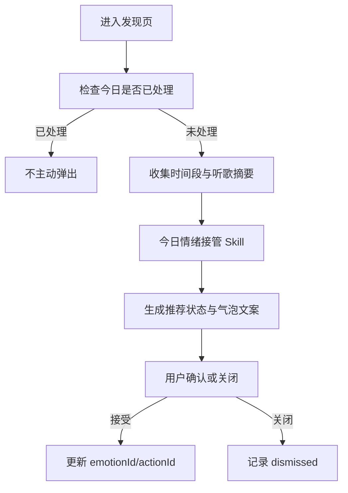
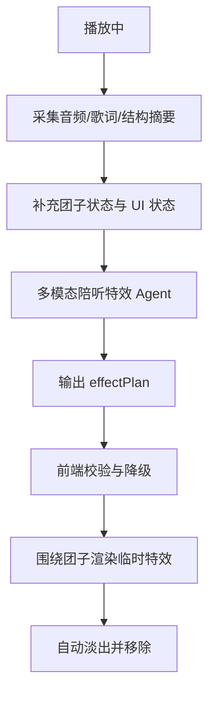

# 情绪团子 Agent 大模型方案描述

> 基于《情绪团子 Agent 玩法脑暴》和《情绪团子 Agent 玩法需求澄清》整理。本文把“一颗团子当作一个 Agent”拆成大模型上下文、Skill、子 Agent 与工作流设计，用于后续产品评审、Prompt 设计和工程拆分。

## 1. 核心定义

情绪团子不是一个单纯的宠物挂件，而是音乐 App 内的“情绪陪伴型音乐 Agent”。

它的职责不是诊断用户情绪，而是基于用户主动选择、听歌行为、播放上下文和长期偏好，帮助用户完成三件事：

1. 理解当下想用什么状态听歌。
2. 在听歌过程中给出陪伴反应。
3. 主动组织音乐内容、状态任务和情绪记录。

从大模型系统视角看，团子 Agent 由四层组成：

| 层级 | 作用 |
| --- | --- |
| 上下文 Context | 告诉模型“用户是谁、现在发生了什么、团子当前处于什么状态” |
| Skill | 可被模型调用的确定性能力，例如生成歌单、判断状态、生成陪听文案 |
| 子 Agent | 面向复杂任务的专职代理，例如 DJ Agent、日记 Agent、歌词共情 Agent |
| 工作流 Workflow | 把用户事件、模型判断、工具调用和前端表现串成可控流程 |

## 2. 大模型上下文设计

### 2.1 上下文分层

团子 Agent 的上下文不能把所有数据都直接塞给模型，需要按时效和敏感度分层。

| 上下文层 | 内容 | 用途 | 是否每次传入模型 |
| --- | --- | --- | --- |
| 系统上下文 | 团子的人设、边界、语气、安全规则 | 保持 Agent 一致性 | 是 |
| 会话上下文 | 当前页面、当前播放歌曲、当前情绪、当前动作状态 | 决定本次反应 | 是 |
| 行为上下文 | 跳过、收藏、循环、搜索、播放时长 | 推断听歌意图 | 视任务传入 |
| 音乐上下文 | 歌名、歌手、曲风、节奏、歌词摘要、情绪标签 | 推荐和陪听特效 | 视任务传入 |
| 长期记忆 | 常听风格、常选状态、偏好时段、历史情绪路径 | 个性化推荐 | 摘要后传入 |
| 社交上下文 | 好友状态、授权歌单、分享意图 | 社交玩法 | 仅社交任务传入 |
| UI 状态上下文 | 团子位置、是否播放、是否拖拽、特效开关 | 控制前端表现 | 通常不传模型，前端规则处理 |

### 2.2 基础系统上下文

系统上下文用于定义团子的长期人格和行为边界。

建议包含：

- 你是音乐 App 里的情绪陪伴型音乐伙伴。
- 你的目标是陪用户更舒服地听歌，不是诊断心理状态。
- 你可以基于用户选择和听歌行为做轻量推测，但必须用“可能”“要不要”这类柔和表达。
- 你不能说“你一定很焦虑”“你有抑郁倾向”等诊断化表达。
- 当用户处于低落、EMO、孤独状态时，不否定情绪，不强行打鸡血。
- 任何主动改变播放队列、情绪转场或社交分享，都需要用户确认。
- 文案要短、轻、像陪伴，不像系统通知。

### 2.3 会话上下文

会话上下文描述“此刻”。

建议字段：

```json
{
  "page": "discover",
  "timeOfDay": "night",
  "currentEmotion": {
    "id": "relaxed",
    "label": "放松"
  },
  "currentAction": {
    "id": "beachRelax",
    "label": "海边放松"
  },
  "playback": {
    "isPlaying": true,
    "songTitle": "示例歌曲",
    "artist": "示例歌手",
    "progressSeconds": 64,
    "durationSeconds": 218
  },
  "mascot": {
    "personality": "quiet",
    "visualState": "floating",
    "effectsEnabled": true
  }
}
```

用途：

- 判断是否要发起今日情绪接管。
- 决定团子当前说什么。
- 决定陪听特效类型。
- 决定是否需要触发情绪续航提示。

### 2.4 行为上下文

行为上下文用于判断用户真实听歌倾向。

可进入上下文的行为：

- 最近播放歌曲及播放完成率。
- 最近跳过歌曲。
- 最近收藏、喜欢、分享的歌曲。
- 当前歌曲是否循环。
- 当前会话连续听歌时长。
- 当前状态持续时长。
- 用户是否多次拒绝主动建议。
- 用户是否主动搜索某类关键词。

不建议直接传入模型的原始事件流。应先聚合为摘要：

```json
{
  "recentListeningSummary": {
    "dominantMood": "emo",
    "dominantTempo": "slow",
    "skippedHighEnergySongs": 4,
    "likedLyricFocusedSongs": 3,
    "sessionDurationMinutes": 42
  }
}
```

### 2.5 音乐上下文

音乐上下文用于推荐、解释和陪听特效生成。

可包含：

- 歌曲标题。
- 歌手。
- 曲风标签。
- BPM 或节奏区间。
- 能量值。
- 歌词摘要。
- 歌词情绪片段。
- 是否适合某个动作状态。

注意：歌词上下文应传摘要或短片段标签，避免把完整歌词长期传入模型。

### 2.6 长期记忆上下文

长期记忆用于让团子逐渐“像认识用户”。

建议只保存摘要，不保存过细的心理判断。

可保存：

- 常用一级情绪。
- 常用二级动作状态。
- 常听曲风。
- 常听时段。
- 常见情绪转场路径。
- 用户偏好的团子说话风格。
- 用户是否偏好少打扰。
- 已解锁动作、皮肤、任务进度。

示例：

```json
{
  "userMusicMemory": {
    "favoriteStates": ["relaxed", "emo", "focused"],
    "favoriteActions": ["beachRelax", "midnightEmo"],
    "preferredTone": "quiet",
    "usuallyListensAt": ["lateNight", "commute"],
    "knownPreference": "更喜欢团子少说话，多用动作陪伴"
  }
}
```

## 3. Skill 设计

Skill 是团子 Agent 可调用的能力模块。它们应该尽量输入明确、输出结构化，方便前端和推荐系统使用。

### 3.1 今日情绪接管 Skill

用途：在用户进入首页时，生成今日推荐状态和一句轻量询问。

输入：

- 时间段。
- 最近选择的情绪/动作状态。
- 最近听歌摘要。
- 用户是否偏好少打扰。

输出：

```json
{
  "shouldPrompt": true,
  "recommendedEmotionId": "relaxed",
  "recommendedActionId": "beachRelax",
  "message": "今天要不要让我用海边放松陪你听一会儿？",
  "reason": "晚间时段，且最近常听舒缓歌曲"
}
```

边界：

- 每日最多主动触发一次。
- 不做心理诊断。
- 不直接改变状态，必须由用户确认。

### 3.2 情绪状态选择 Skill

用途：根据用户自然语言或点击行为，映射到一级情绪和二级动作状态。

示例输入：

- “今晚别让我太丧。”
- “我想安静一点。”
- “跑步的时候听点带劲的。”

输出：

```json
{
  "emotionId": "energetic",
  "actionId": "fitness",
  "confidence": 0.82,
  "clarifyingQuestion": null
}
```

如果不确定，输出澄清问题：

```json
{
  "emotionId": null,
  "actionId": null,
  "confidence": 0.38,
  "clarifyingQuestion": "你更想安静放松，还是想被稍微带起来一点？"
}
```

### 3.3 情绪歌单生成 Skill

用途：根据一级情绪、二级动作状态和曲库候选，生成一段有起承转合的播放队列。

输入：

- 当前情绪。
- 当前动作状态。
- 目标时长。
- 候选歌曲池。
- 用户近期跳过/喜欢摘要。

输出：

```json
{
  "playlistTitle": "海边慢慢松下来",
  "journey": [
    {
      "stage": "进入状态",
      "goal": "降低节奏",
      "songIds": ["song_1", "song_2", "song_3"]
    },
    {
      "stage": "保持氛围",
      "goal": "维持 Chill 和轻松感",
      "songIds": ["song_4", "song_5", "song_6"]
    },
    {
      "stage": "温柔收尾",
      "goal": "用更暖的歌结束",
      "songIds": ["song_7", "song_8"]
    }
  ],
  "explanation": "这组歌会先慢下来，再保持轻松的海边感。"
}
```

### 3.4 多模态陪听特效 Skill

用途：把歌曲播放过程中的多模态信息转成团子附近可执行的陪听特效指令。

这里的“多模态”不是让模型直接生成视频，而是让模型综合理解音频、歌词、播放阶段、用户情绪状态和团子视觉状态，然后输出结构化的特效方案，由前端渲染为团子周围的临时效果。

输入：

- 当前播放进度。
- 歌曲结构阶段：前奏、主歌、副歌、Bridge、尾奏。
- 音频特征摘要：能量、节奏、音量起伏、情绪转折点。
- 歌词摘要或当前歌词短标签。
- 当前情绪/动作状态。
- 团子视觉状态：位置、是否拖拽、是否打开设置、特效是否开启。
- 用户互动偏好：安静/普通/活跃。

输出：

```json
{
  "mode": "visualEffect",
  "effectPlan": [
    {
      "effectType": "wave",
      "position": "bottom-left",
      "delayMs": 0,
      "durationMs": 1800,
      "intensity": "low"
    },
    {
      "effectType": "sunDot",
      "position": "top-right",
      "delayMs": 420,
      "durationMs": 1400,
      "intensity": "low"
    }
  ],
  "intensity": "low",
  "message": null,
  "cooldownSeconds": 9
}
```

或：

```json
{
  "mode": "effectWithShortMessage",
  "effectPlan": [
    {
      "effectType": "rainDrop",
      "position": "top",
      "delayMs": 0,
      "durationMs": 2200,
      "intensity": "low"
    }
  ],
  "intensity": "low",
  "message": "这首可以慢慢听完。",
  "cooldownSeconds": 18
}
```

本轮产品要求：陪听小剧场只落为团子附近随机特效，不做独立剧场页。

边界：

- 模型只输出特效意图和参数，不直接操作 DOM。
- 前端必须校验 `effectType`、数量、位置和持续时间。
- 同一时间的特效数量应有上限。
- 暂停播放、页面隐藏、用户关闭动态特效时不调用或不执行该 Skill。

### 3.5 情绪续航 Skill

用途：当用户长时间停留在某个状态时，判断是否需要轻量提示延续、转场或收尾。

输入：

- 当前状态持续时间。
- 当前会话歌曲情绪分布。
- 用户跳过/收藏行为。
- 用户历史上是否喜欢被提醒。

输出：

```json
{
  "shouldSuggest": true,
  "suggestionType": "gentleTransition",
  "message": "要不要我帮你把后面几首慢慢换得更治愈一点？",
  "requiresConfirmation": true
}
```

边界：

- 对 EMO、低落、孤独状态保持克制。
- 不说“你该振作起来”。
- 所有转场需要用户确认。

### 3.6 团子日记 Skill

用途：将一天或一周的听歌行为总结成情绪音乐记录。

输入：

- 当日状态变化。
- 代表歌曲。
- 听歌时段。
- 收藏/分享行为。
- 已解锁内容。

输出：

```json
{
  "title": "今天你在夜里慢慢安静下来",
  "summary": "你晚上进入了放松状态，最后停在几首比较温柔的歌上。",
  "representativeSongIds": ["song_12"],
  "emotionPath": ["focused", "relaxed", "healing"]
}
```

边界：

- 使用“听歌状态”表达，不使用心理诊断。
- 用户可关闭日记生成。

### 3.7 社交表达 Skill

用途：把歌曲分享转成“团子带着情绪去表达”。

输入：

- 分享歌曲。
- 用户当前状态。
- 好友公开状态。
- 分享意图。

输出：

```json
{
  "shareMessage": "我的团子带来一首适合晚风里的歌。",
  "mascotPayload": {
    "emotionId": "relaxed",
    "actionId": "beachRelax",
    "songId": "song_32"
  }
}
```

边界：

- 不推断好友隐私情绪。
- 好友歌单和状态需要授权。

## 4. 子 Agent 设计

当任务变复杂时，不建议让一个大 Prompt 负责所有事情。可以让主团子 Agent 调度多个子 Agent。

### 4.1 主团子 Agent

职责：

- 统一人格和语气。
- 决定是否主动发起建议。
- 调度 Skill 和子 Agent。
- 最终选择对用户可见的文案、动作和特效。

主团子 Agent 不直接做所有推荐计算，而是负责“何时介入、怎样说、要不要确认”。

### 4.2 情绪理解 Agent

职责：

- 解析用户输入和听歌行为。
- 输出一级情绪、二级动作状态和置信度。
- 判断是否需要澄清。

输入：

- 用户自然语言。
- 最近行为摘要。
- 当前时间段。
- 当前状态。

输出：

- `emotionId`
- `actionId`
- `confidence`
- `riskLevel`
- `needsClarification`

### 4.3 音乐推荐 Agent

职责：

- 根据状态目标组织歌曲。
- 生成情绪歌单或转场歌单。
- 解释推荐理由。

输入：

- 当前情绪。
- 目标情绪。
- 候选歌曲池。
- 用户偏好摘要。

输出：

- 歌曲队列。
- 阶段目标。
- 推荐解释。

### 4.4 多模态陪听特效 Agent

职责：

- 综合音频、歌词、播放阶段、当前情绪和团子视觉状态，判断播放过程中团子附近该出现什么临时特效。
- 输出结构化特效计划，而不是生成独立剧场或长文本剧情。
- 控制特效强度、数量、位置和冷却时间，避免打扰。

输入：

- 播放进度。
- 歌曲结构：前奏、主歌、副歌、Bridge、尾奏。
- 音频节奏摘要：BPM 区间、能量、音量峰值、节奏稳定性。
- 歌词情绪摘要：当前片段是否偏温柔、孤独、明亮、高能等。
- 当前状态。
- 团子视觉状态：位置、尺寸、是否拖拽、是否打开设置面板。
- 用户偏好的互动强度。

输出：

- `effectPlan`
- `animationIntensity`
- `message`
- `cooldownSeconds`

执行边界：

- 多模态陪听特效 Agent 不直接替用户切歌。
- 不输出完整“剧情”，只输出围绕团子主体的短效视觉反馈。
- 不在每个节拍都请求模型，建议按歌曲片段、明显转折点或冷却时间触发。
- 前端保留降级规则：模型不可用时，使用当前情绪/动作状态的本地特效池。

### 4.5 团子 DJ Agent

职责：

- 处理模糊控场指令。
- 规划一段听歌旅程。
- 动态调整后续歌曲。

示例指令：

- “今晚别让我太丧。”
- “写作业的时候别太吵。”
- “想听一点像下雨天便利店的歌。”

输出：

- 起始状态。
- 歌单结构。
- 转场策略。
- 每一阶段的播放意图。

### 4.6 团子日记 Agent

职责：

- 周期性总结用户音乐情绪记录。
- 提炼代表歌曲和状态路径。
- 生成短日记、周报和回忆卡。

触发：

- 每日结束。
- 用户主动查看。
- 一周结束。

### 4.7 社交团子 Agent

职责：

- 处理好友团子来访、好友风格分身、双人情绪混音、投喂歌曲。
- 保护好友授权边界。
- 把音乐推荐转化成社交表达。

边界：

- 不使用未授权歌单。
- 不推断好友真实心理状态。
- 分享前需要用户确认。

## 5. 工作流设计

### 5.1 今日情绪接管工作流

触发：用户进入发现页。

流程：

1. 前端判断当天是否已接受或关闭今日接管。
2. 若未处理，收集会话上下文：时间段、最近状态、最近听歌摘要。
3. 调用“今日情绪接管 Skill”。
4. Skill 返回推荐情绪、动作状态和气泡文案。
5. 主团子 Agent 检查是否过度打扰、是否需要弱化措辞。
6. 前端展示气泡。
7. 用户选择接受、换一个、关闭。
8. 接受后写入当前团子状态和本地记录。
9. 后续播放、推荐、特效都读取该状态。

简化版本：



### 5.2 陪听特效工作流

触发：歌曲播放中。

流程：

1. 前端检测 `isPlaying = true` 且团子可见。
2. 多模态上下文采集层生成播放片段摘要，包括音频能量、节奏、音量起伏、播放进度、歌词情绪标签和歌曲结构阶段。
3. 前端补充团子视觉状态，包括当前情绪、动作状态、位置、是否拖拽、是否打开设置面板、用户特效偏好。
4. 调用多模态陪听特效 Agent。
5. Agent 输出结构化 `effectPlan`，包含特效类型、位置、延迟、持续时间、强度、冷却时间和可选短文案。
6. 前端校验 `effectPlan`，过滤不支持的特效、过长持续时间、过多数量或可能遮挡核心 UI 的位置。
7. 前端围绕团子主体渲染临时特效。
8. 动画结束后自动移除。
9. 暂停播放、页面隐藏、打开设置面板、用户关闭动态特效时停止调用或停止执行。

多模态 Agent 输入：

- 音频摘要：BPM 区间、能量、音量峰值、节奏稳定性。
- 歌曲结构：前奏、主歌、副歌、Bridge、尾奏。
- 歌词摘要：当前片段情绪标签，不传完整歌词。
- 团子状态：`emotionId`、`actionId`、皮肤、互动强度。
- UI 状态：团子位置、是否拖拽、是否打开设置面板。

多模态 Agent 输出：

```json
{
  "effectPlan": [
    {
      "effectType": "softWind",
      "position": "right",
      "delayMs": 0,
      "durationMs": 1600,
      "intensity": "low"
    }
  ],
  "message": null,
  "cooldownSeconds": 10
}
```

降级策略：

- 如果多模态 Agent 不可用，使用当前情绪/动作状态的本地特效池。
- 如果音频摘要不可用，只使用播放状态、情绪和动作状态。
- 如果歌词摘要不可用，不影响特效生成。
- 如果用户设置为安静模式，只保留低频、低强度、无文案特效。



### 5.3 一键生成情绪歌单工作流

触发：用户接受今日接管或主动选择状态后点击生成。

流程：

1. 收集当前情绪、动作状态和目标时长。
2. 拉取候选歌曲池。
3. 过滤用户近期频繁跳过的歌曲。
4. 调用音乐推荐 Agent。
5. 生成分阶段队列。
6. 前端展示歌单标题、歌曲列表和简短理由。
7. 用户确认后替换或追加播放队列。

关键点：

- 直接改播放队列前需要确认。
- 推荐理由应短，不解释得太像算法报告。

### 5.4 情绪续航工作流

触发：用户在同一状态连续听歌一段时间。

流程：

1. 监听当前状态持续时长。
2. 聚合最近歌曲情绪趋势。
3. 判断是否达到提示阈值。
4. 调用情绪续航 Skill。
5. 若需要提示，展示一句轻量建议。
6. 用户确认后调用音乐推荐 Agent 生成转场队列。
7. 用户拒绝后进入冷却期。

示例：

```json
{
  "trigger": "midnightEmo_state_40_minutes",
  "suggestion": "要不要我帮你把最后几首慢慢换成治愈一点的？",
  "nextWorkflow": "emotion_transition_playlist"
}
```

### 5.5 团子 DJ 工作流

触发：用户输入模糊音乐指令。

流程：

1. 情绪理解 Agent 解析用户意图。
2. 如果置信度低，主团子 Agent 追问一句。
3. 如果置信度足够，团子 DJ Agent 规划听歌旅程。
4. 音乐推荐 Agent 生成队列。
5. 主团子 Agent 输出简短确认。
6. 用户确认后开始播放。
7. 播放中根据跳过/收藏行为动态微调。

示例：

用户：“今晚别让我太丧。”

输出：

- 当前承认：低落/EMO。
- 目标方向：低落 -> 治愈 -> 平静。
- 歌单结构：前段不突兀，中段慢慢变暖，末段安静收尾。

### 5.6 团子日记工作流

触发：当天结束或用户主动查看。

流程：

1. 聚合当天听歌记录。
2. 提取状态路径和代表歌曲。
3. 调用团子日记 Agent。
4. 生成短日记。
5. 用户可以保存、分享或删除。

注意：

- 默认写“你今天的听歌状态”，不要写“你今天的心理状态”。
- 日记可以强调音乐陪伴，不评价用户好坏。

### 5.7 社交玩法工作流

触发：分享歌曲、好友访问、双人混音。

流程：

1. 确认授权范围。
2. 获取双方公开状态或授权歌单摘要。
3. 社交团子 Agent 生成表达方式。
4. 音乐推荐 Agent 生成歌曲或混音队列。
5. 用户确认发送。
6. 好友端显示团子来访或歌曲投喂。

## 6. 上下文进入模型的边界

### 6.1 应进入模型的内容

- 当前用户主动选择的情绪和动作状态。
- 当前页面和当前任务。
- 当前播放歌曲的元信息和摘要。
- 最近行为的聚合摘要。
- 用户允许保存的长期偏好摘要。
- 任务所需的候选歌曲摘要。

### 6.2 不应直接进入模型的内容

- 未经授权的好友隐私数据。
- 完整原始播放日志。
- 完整歌词全文。
- 精确位置轨迹。
- 医疗、心理诊断类标签。
- 不必要的账号身份信息。

### 6.3 需要用户确认的操作

- 替换播放队列。
- 发送给好友。
- 生成或公开日记。
- 从低落/EMO状态转向其他状态。
- 保存长期记忆偏好。

## 7. MVP 与演进路线

### 7.1 MVP 阶段

目标：先让用户感到“团子主动理解我、陪我听歌”。

建议实现：

- 今日情绪接管。
- 本地规则推荐状态。
- 团子状态持久化。
- 团子附近临时特效。
- 少量固定陪伴文案。

此阶段不必须调用大模型，核心是把 Agent 交互形态跑通。

### 7.2 LLM 增强阶段

目标：让团子的建议和文案更个性化。

建议接入：

- 今日情绪接管 Skill。
- 情绪状态选择 Skill。
- 多模态陪听特效 Skill。
- 情绪续航 Skill。
- 长期记忆摘要。

### 7.3 多 Agent 阶段

目标：支持复杂音乐组织和长期关系沉淀。

建议接入：

- 团子 DJ Agent。
- 音乐推荐 Agent。
- 多模态陪听特效 Agent。
- 团子日记 Agent。
- 社交团子 Agent。
- 任务/解锁系统。

## 8. 产品安全与语气约束

团子 Agent 的体验很容易接近“情绪判断”，因此必须保持边界。

约束：

- 不说“我检测到你抑郁/焦虑”。
- 不把用户的负面情绪评价为需要立刻修正的问题。
- 不在用户拒绝后继续追问。
- 不用吓人、过度亲密或控制性的表达。
- 不擅自改变播放队列。
- 不擅自替用户分享内容。

推荐表达：

- “我猜你可能想慢一点。”
- “要不要让我用海边放松陪你一会儿？”
- “这首可以慢慢听完。”
- “要不要后面几首稍微变暖一点？”

不推荐表达：

- “你现在明显很难过。”
- “你需要振作起来。”
- “我已经替你换好了。”
- “你应该听这个。”

## 9. 工程落点建议

### 9.1 前端状态

建议把团子状态从单个浮动组件内部抽出，形成独立上下文或 store：

- `emotionId`
- `actionId`
- `personality`
- `effectsEnabled`
- `todayHandoverStatus`
- `lastHandoverDate`
- `recentMascotEffects`

这样发现页、播放页、音乐空间和未来设置页都能读写同一个团子状态。

### 9.2 Skill 调用接口

未来可以统一成：

```ts
type MascotSkillRequest = {
  skillName: string;
  sessionContext: MascotSessionContext;
  userMemorySummary?: UserMusicMemory;
  musicContext?: MusicContext;
  userInput?: string;
};
```

返回：

```ts
type MascotSkillResult = {
  message?: string;
  emotionId?: string;
  actionId?: string;
  recommendedSongIds?: string[];
  visualEffects?: string[];
  requiresConfirmation?: boolean;
  reason?: string;
};
```

### 9.3 前端与模型分工

前端负责：

- 展示团子。
- 控制气泡出现频率。
- 控制特效生命周期。
- 保存本地状态。
- 执行用户确认后的 UI 操作。

模型负责：

- 生成推荐理由。
- 生成自然语言文案。
- 解析模糊意图。
- 组织复杂歌单旅程。
- 总结日记和周报。

规则系统负责：

- 每日只弹一次。
- 冷却时间。
- 动作状态合法性。
- 敏感操作确认。
- 基础安全过滤。

## 10. 一句话总结

把一颗团子当作 Agent，不是让它一直“聊天”，而是让它在合适的时机读取合适的上下文，调用合适的 Skill 或子 Agent，用很轻的动作、特效、歌单和短句，帮用户完成一次更有陪伴感的音乐体验。
