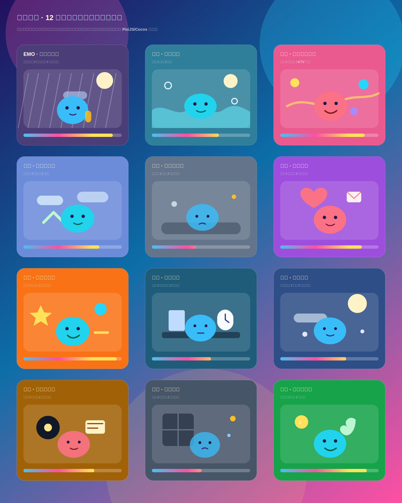

# 情绪团子游戏拓展方案：雨夜补给站

## 一、方案定位

「雨夜补给站」是情绪团子的轻量 Web 游戏拓展玩法。它不是独立音游，也不是重度养成游戏，而是一个和听歌行为自然绑定的情绪陪伴小游戏。

用户在播放音乐时，小宠物会根据当前情绪积累「情绪能量」。在 EMO 状态下，用户可以通过听歌、点击掉落物、长按陪伴等轻互动，为 EMO 小宠物加油，让它从「低电量 EMO」逐渐变成「被陪伴的 EMO」。

核心表达不是让用户立刻开心，而是陪用户承认当下情绪，并把听歌过程变成一种温柔的情绪补给。

## 二、核心目标

1. 增强音乐播放过程中的陪伴感。
2. 让用户的情绪选择产生可见反馈。
3. 用轻游戏机制提高用户停留和复访。
4. 为后续皮肤、动作、房间、社交展示提供成长系统基础。
5. 不干扰原有音乐播放和推荐体验。

## 三、玩法概念

用户选择「EMO」情绪后，小宠物进入雨夜状态：

- 小宠物缩成一团。
- 头顶有小雨云。
- 背景为雨夜、窗边、霓虹反光。
- 播放歌曲时掉落「歌词碎片」「雨滴音符」「共鸣光点」。
- 用户可以点击或拖动小宠物接住掉落物。
- 掉落物会转化为「情绪能量」。
- 情绪能量满后，小宠物获得一次状态成长。

状态成长不是从 EMO 变快乐，而是从孤单变得被陪伴。

## 四、推荐小游戏形态

### 玩法名称

雨夜能量收集

### 基础规则

1. 用户播放歌曲后，小游戏自动开始。
2. 屏幕上方随机掉落情绪物品。
3. 用户点击掉落物，或拖动小宠物接住掉落物。
4. 每个掉落物增加一定情绪能量。
5. 播放本身也会自动积累基础情绪能量。
6. 情绪能量满后触发小宠物状态变化或奖励。

### 设计原则

- 不设置失败。
- 不设置扣分。
- 不设置 Game Over。
- 不强迫用户持续操作。
- 听歌本身就是有效行为。
- 手动互动只是加速成长和增强陪伴感。

## 五、核心循环

用户进入音乐页：

选择情绪 → 播放歌曲 → 生成情绪掉落物 → 用户轻互动 → 积累情绪能量 → 小宠物状态变化 → 解锁动作/皮肤/房间物件 → 生成今日情绪卡

一个完整循环以一首歌为单位，约 3 到 5 分钟。

## 六、EMO 状态细化

### 初始表现

- 小宠物缩成一团。
- 动作慢，呼吸轻。
- 头顶有小雨云。
- 周围有雨滴、雾气、低亮度光效。
- 情绪能量条名称为「共鸣能量」或「被陪伴值」。

### 互动方式

- 点击小宠物：出现「加油叭」小气泡。
- 长按小宠物：触发拥抱或安抚动作。
- 点击歌词碎片：获得共鸣能量。
- 接住雨滴音符：获得少量能量。
- 接住共鸣光点：获得较多能量。
- 听完一首 EMO 歌：点亮一盏小夜灯。

### 能量满反馈

- 雨变小。
- 小宠物慢慢抬头。
- 身边出现微光。
- 小夜灯亮起。
- 小宠物获得一个短动作，例如抱耳机、看窗外、轻轻点头。

推荐反馈文案：

> 今天也有好好听完自己的心情。

## 七、掉落系统

### 掉落类型

| 掉落物 | 表现 | 作用 |
| --- | --- | --- |
| 雨滴音符 | 蓝色雨滴形音符 | 少量情绪能量 |
| 歌词碎片 | 发光纸片 | 中量情绪能量 |
| 共鸣光点 | 柔和光球 | 大量情绪能量 |
| 小夜灯火花 | 暖色星点 | 特殊奖励进度 |

### 掉落来源

1. 自动掉落：播放歌曲时定时生成。
2. 节奏掉落：根据音频节奏、音量起伏生成。
3. 情绪掉落：根据当前情绪生成专属物品。
4. 完播奖励：听完一首歌后获得额外能量。

### 掉落频率建议

首版不要太密集：

- 普通掉落：每 4 到 6 秒一次。
- 节奏掉落：音乐高潮或强节拍时少量增加。
- 特殊掉落：每首歌最多 1 到 2 次。

## 八、成长与奖励

### 成长阶段

| 阶段 | 状态 | 表现 |
| --- | --- | --- |
| 0 | 低电量 EMO | 缩成一团，雨较大 |
| 1 | 被听见 | 旁边出现微光 |
| 2 | 被陪伴 | 小夜灯亮起 |
| 3 | 慢慢恢复 | 雨变小，小宠物抬头 |
| 4 | 今日补给完成 | 解锁动作或装饰 |

### 奖励类型

1. 小动作：抱耳机、看窗外、轻轻发光、缩成一团。
2. 皮肤套装：雨夜耳机、深蓝围巾、歌词纸条。
3. 房间物件：小夜灯、雨窗、抱枕、唱片机。
4. 情绪卡片：生成今日 EMO 情绪卡。

### EMO 专属奖励示例

- 雨夜小灯
- 深蓝耳机
- 歌词纸条
- 窗边抱枕
- 小雨云背景
- 霓虹窗景

## 九、和现有项目结合

当前项目已有基础：

- 小宠物浮层。
- 情绪设置。
- 动作状态。
- 皮肤套装入口。
- 音频节奏响应。

建议新增一个可配置 tab：

「情绪能量」或「小游戏」

首版逻辑：

- 只在 EMO 情绪下展示完整小游戏。
- 其他情绪展示基础能量积累状态。
- 不改原有音乐接口。
- 不影响播放器功能。
- 只监听当前播放状态、当前情绪、播放时长和音频节奏。

## 十、MVP 范围

第一版只做最小可验证版本：

1. 新增「情绪能量」tab。
2. EMO 状态下展示雨夜小游戏。
3. 播放歌曲时自动增长共鸣能量。
4. 随机掉落 2 到 3 种情绪物品。
5. 点击掉落物增加能量。
6. 能量满后切换小宠物表现。
7. 解锁 1 个 EMO 小动作或装饰。

暂不做：

- 排行榜。
- 复杂关卡。
- 失败惩罚。
- 多人玩法。
- 付费抽卡。
- 所有 12 个情绪的完整玩法。

## 十一、后续拓展

### 1. 扩展到其他情绪

| 情绪 | 小游戏主题 | 场景关键词 | 掉落物 |
| --- | --- | --- | --- |
| 平静 | 月光呼吸 | 月亮、云层、低速漂浮 | 月光粒子、云朵、白噪音球 |
| 快乐 | 彩盒彩纸派对 | 彩纸、KTV 光球、弹跳舞台 | 彩纸、笑脸星、KTV 光球 |
| 治愈 | 云朵修补屋 | 云朵、柔光、创可贴 | 棉花云、创可贴、柔光 |
| 放松 | 海边漂流 | 海浪、泡泡、躺平漂流 | 泡泡、贝壳、月光 |
| 低落 | 灰蓝收纳箱 | 灰蓝空间、暖灯、慢速整理 | 小石子、纸团、暖灯火花 |
| EMO | 雨夜补给站 | 雨夜、月亮、小夜灯 | 雨滴音符、歌词碎片、共鸣光点 |
| 浪漫 | 心动收信 | 信笺、玫瑰光、心形轨迹 | 信笺、玫瑰光、心形光点 |
| 怀旧 | 旧唱片修复 | 黑胶、磁带、老照片 | 磁带、老照片、黑胶星尘 |
| 元气 | 节拍充电站 | 充电台、星星、跳跃节拍 | 星星、能量球、火花 |
| 专注 | 书桌整理 | 书桌、时钟、灵感点 | 书页、时钟碎片、灵感点 |
| 孤独 | 夜窗守灯 | 夜窗、小灯、远方信号 | 窗光、信号点、小灯火花 |
| 幸运 | 好运扭蛋机 | 四叶草、金币、扭蛋机 | 四叶草、金币、好运星 |

### 2. 游戏场景原型图

下图是 12 种情绪设置对应的小游戏场景低保真原型。EMO 的「雨夜补给站」延续当前播放页中的雨夜、月亮、小夜灯、小宠物和共鸣能量条设计；其他情绪使用同一套产品结构，只替换场景主题、掉落物和情绪反馈。

### 3. 情绪房间

小游戏奖励可以变成房间物件。用户长期听歌后，形成自己的情绪房间。

### 4. 今日情绪卡

每天听歌结束后，生成一张卡片：

- 小宠物形象
- 今日情绪
- 今日动作状态
- 今日获得的能量
- 今日代表歌曲
- 一句情绪总结

### 5. 好友串门

好友看到的不只是头像，而是带情绪状态和房间物件的小宠物。用户可以让自己的团子去好友房间听一首歌，带回一个小纪念物。

## 十二、关键体验判断

这个玩法是否成立，重点看三个问题：

1. 用户是否愿意在听歌时顺手和小宠物互动？
2. 用户是否能理解「情绪能量」不是战斗数值，而是陪伴反馈？
3. 用户是否愿意为了小动作、皮肤、房间物件继续回来听歌？

如果这三个问题成立，情绪团子就可以从播放器装饰升级为音乐陪伴型 Web 游戏系统。
